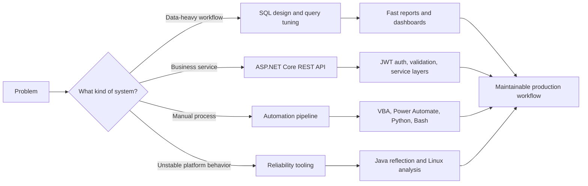

<div align="center">

# Skill Console

**.NET backend systems | REST APIs | SQL performance | automation | reliability tooling**

<a href="#backend-and-apis"></a>
<a href="#data-and-performance"></a>
<a href="#automation-and-tooling"></a>
<a href="#reliability-and-research"></a>

</div>

---

## Pick A Skill Path

| Open | Skill path | What it shows |
| --- | --- | --- |
| [Backend and APIs](#backend-and-apis) | C#, .NET, REST, auth | Service design, API contracts, validation, maintainability |
| [Data and Performance](#data-and-performance) | SQL Server, PostgreSQL, query tuning | Data modeling, reporting, optimization, production-minded reads |
| [Automation and Tooling](#automation-and-tooling) | VBA, Power Automate, Python, Bash | Repeatable workflows, one-click pipelines, developer utilities |
| [Reliability and Research](#reliability-and-research) | Java reflection, Linux, cross-platform analysis | Stability tooling, OS behavior analysis, evidence-driven debugging |
| [Engineering Habits](#engineering-habits) | SOLID, tests, docs, CI/CD | How the code stays understandable after it ships |

---

## Skill Map



---

## Core Stack

<p align="center">
  
  
  
  
  
  
  
  
  
  
  
  
  
</p>

---

## Backend And APIs

<details open>
<summary><b>Open the backend module</b></summary>

### Main Tools

| Layer | Skills |
| --- | --- |
| Language | C#, Java, Python |
| Frameworks | .NET 4.8, .NET 6, ASP.NET Core, Blazor |
| API design | REST endpoints, request/response contracts, JSON, XML, Swagger docs |
| Security | JWT authentication, refresh-token flows, API authorization boundaries |
| Runtime | IIS hosting, service configuration, production troubleshooting |
| Validation | Postman collections, API validation, unit testing, defensive input handling |

### Backend Playbook

```csharp
public sealed class BackendPlaybook
{
    public string[] Build =
    {
        "Clear service boundaries",
        "RESTful API contracts",
        "JWT-secured flows",
        "Readable business logic",
        "SQL-aware data access"
    };

    public string[] Optimize =
    {
        "Profile slow paths first",
        "Simplify expensive queries",
        "Keep endpoints predictable",
        "Document behavior at the edge"
    };
}
```

</details>

---

## Data And Performance

<details open>
<summary><b>Open the data module</b></summary>

| Data skill | What it is good for |
| --- | --- |
| Microsoft SQL Server | Enterprise reporting, stored logic, query tuning, relational design |
| Transact-SQL | Complex joins, filtering, aggregation, performance-focused reads |
| PostgreSQL | Relational application storage and schema design |
| MySQL | Web application data storage and query development |
| Oracle SQL | Enterprise support, configuration analysis, operational troubleshooting |
| Entity Framework Core | .NET data access with maintainable service-layer boundaries |

### Query Tuning Checklist

- Find the slowest path before changing code.
- Inspect joins, filters, projections, and unnecessary row movement.
- Keep reporting queries readable enough to maintain.
- Design APIs with database cost in mind.
- Measure again after every meaningful change.

</details>

---

## Automation And Tooling

<details open>
<summary><b>Open the automation module</b></summary>

| Tool | Skill expression |
| --- | --- |
| VBA | Excel-driven workflow automation, macros, data cleanup, repeatable processing |
| Power Automate | Low-code business process automation and handoff workflows |
| Python | Scripts, analysis pipelines, data processing, test utilities |
| Bash and Linux | Reproducible command-line pipelines and system analysis |
| GitHub and GitLab | Source control workflows, collaboration, branch-based delivery |

### Automation Mindset

```yaml
manual_workflow:
  inspect: "Where does time disappear?"
  compress: "Remove repeated clicks and fragile handoffs"
  automate: "Turn the workflow into a repeatable pipeline"
  verify: "Make output easy to check"
  document: "Leave the next maintainer a map"
```

</details>

---

## Reliability And Research

<details open>
<summary><b>Open the reliability module</b></summary>

| Focus | Skills |
| --- | --- |
| Java reflection | Runtime inspection, platform API exploration, compatibility testing |
| Cross-platform analysis | Comparing behavior across OS releases and device classes |
| Linux tooling | Bash pipelines, system measurements, reproducible experiments |
| Statistical evaluation | Interpreting system behavior from measured results |
| Technical writing | Turning findings into clear, reviewable documentation |

### Reliability Loop

```text
observe -> instrument -> compare -> explain -> verify -> document
```

</details>

---

## Engineering Habits

<details open>
<summary><b>Open the maintainability module</b></summary>

| Habit | How it shows up |
| --- | --- |
| SOLID design | Smaller services, clearer responsibilities, easier changes |
| OOP and patterns | Practical structure without unnecessary ceremony |
| Unit testing | Behavior checks around business logic and API boundaries |
| CI/CD awareness | Code shaped for repeatable delivery and review |
| API documentation | Swagger, readable contracts, validation examples |
| Agile SDLC | Incremental delivery, feedback loops, clean handoffs |
| Technical documentation | Decisions, setup notes, debugging paths, system behavior |

</details>

---

## Skill Matrix

| Capability | C#/.NET | Java | Python | SQL | Automation |
| --- | --- | --- | --- | --- | --- |
| REST API development | Core | Applied | Applied | Supporting | Supporting |
| Authentication flows | Core | Supporting | Supporting | Supporting | - |
| Dashboard/reporting data | Core | - | Applied | Core | Supporting |
| Workflow automation | Applied | - | Applied | Supporting | Core |
| Platform reliability tooling | Supporting | Core | Applied | Supporting | Applied |
| Production debugging | Core | Applied | Applied | Core | Applied |

---

## Build Modes

<details>
<summary><b>Mode 1: API Builder</b></summary>

```text
Input: business workflow
Output: documented REST API with validation, auth, service boundaries, and database-aware behavior
Preferred stack: C# + ASP.NET Core + EF Core + SQL Server + Swagger + Postman
```

</details>

<details>
<summary><b>Mode 2: Data Optimizer</b></summary>

```text
Input: slow report, dashboard, or batch process
Output: cleaner query shape, reduced load time, and easier maintenance
Preferred stack: SQL Server + T-SQL + indexing awareness + measured profiling
```

</details>

<details>
<summary><b>Mode 3: Workflow Automator</b></summary>

```text
Input: repetitive manual process
Output: repeatable pipeline with fewer handoffs and easier verification
Preferred stack: VBA + Power Automate + Python + Bash where useful
```

</details>

<details>
<summary><b>Mode 4: Reliability Investigator</b></summary>

```text
Input: inconsistent platform behavior
Output: reproducible tests, measured evidence, and technical explanation
Preferred stack: Java reflection + Linux + Python/Bash analysis + documentation
```

</details>

---

<div align="center">

### Favorite Problems To Solve

**Slow systems becoming fast. Manual workflows becoming one-click. APIs becoming predictable. Data becoming useful. Platform behavior becoming explainable.**

</div>
